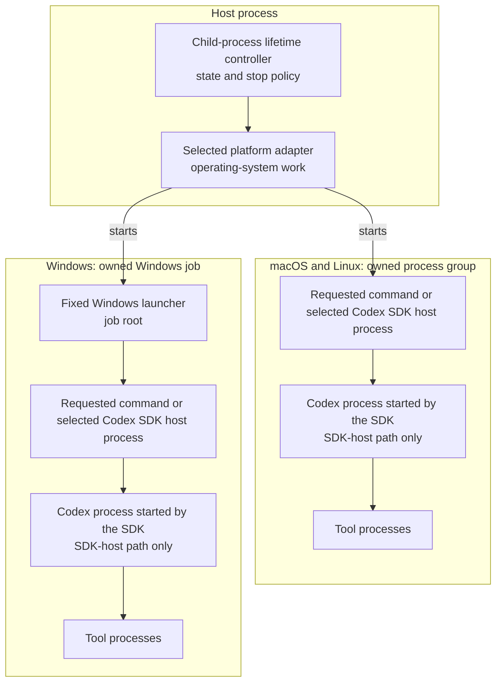

# Child-process lifetime

## Terms

- **Host process**: the top-level Repo Edu process. The desktop main process
  and the command-line process are host processes.
- **Child-process lifetime controller**: the shared object that owns launch
  admission, active owned trees and stop policy.
- **Platform adapter**: the POSIX or Windows implementation that turns the
  controller's common contract into operating-system work.
- **Owned child-process tree**: the handle returned by one launch. It owns the
  requested command and every descendant. On Windows, it also owns the fixed
  launcher that is the job root.
- **Windows launcher**: the fixed process that the Windows platform adapter
  starts and assigns to its job before target work is admitted. The launcher
  then starts the requested command. It is private to the adapter.
- **Codex SDK host process**: the project-owned process that accepts one
  prompt/reply request, runs the Codex SDK and streams LLM events.
- **Plan-step Codex SDK host process**: the project-owned process that accepts
  one plan-step coding request, runs one fresh Codex SDK thread and streams
  coding events.
- **Stop-and-confirm**: stopping an owned child-process tree and waiting until
  the full tree is confirmed gone.
- **Launch owner**: the architecture-inventory fact that names which code
  places a product process inside the child-process lifetime boundary. It is
  not a runtime launch option.

## How the parts fit

Each platform box is one owned child-process tree. The arrow inside the host
process box is an object call: the controller selects the platform adapter.
Every other arrow is a parent-child process edge.

On macOS and Linux, the platform adapter starts the requested command as the
process-group root. On Windows, the platform adapter starts the fixed Windows
launcher as the job root. The launcher starts the requested command only after
the job owns the launcher.

### Controller and platform adapters

The controller accepts launch requests, tracks launches still starting and
tracks active owned trees. Once shutdown starts, it stops admitting launches,
asks every owned tree to stop and waits until all of them are confirmed gone.
These are control and policy duties.

A platform adapter performs the operating-system work behind that policy. The
POSIX adapter starts and signals a process group. The Windows adapter creates a
job, starts the fixed launcher, assigns it to the job before target work is
admitted and confirms that the job is empty.

### Owned child-process tree

One controller launch returns one owned-tree handle. The handle provides the
requested command's input, output and result, plus operations to request a stop
and to stop-and-confirm the whole tree.

The ownership boundary includes descendants. A command result cannot settle
the lifetime boundary while a descendant remains alive.

### Requested commands and Codex SDK host processes

There is no extra cross-platform lifetime process that every command must
start. On macOS and Linux, the requested command is the process-group root. On
Windows, the fixed launcher is the job root and the requested command is its
child.

For Codex work, the requested command is one of the two Codex SDK host
processes. That process runs the SDK. The SDK starts the Codex process, which
may start tool processes. The prompt/reply and plan-step families stay separate
because they accept different requests and return different results.

Both SDK host processes are descendants inside a controller-owned tree. The
selected SDK host process is a direct child of the host process on macOS and
Linux. It is a grandchild of the host process on Windows.
