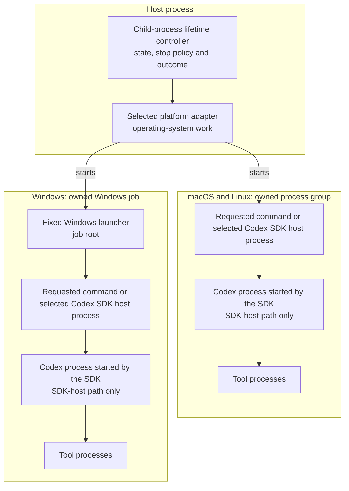

# Child-process lifetime

## Terms

- **Host process**: the top-level Repo Edu process. The desktop main process
  and the command-line process are host processes.
- **Child-process lifetime controller**: the shared object that owns launch
  admission, active owned trees, stop policy and each run's one terminal
  outcome.
- **Platform adapter**: the POSIX or Windows implementation that turns the
  controller's common contract into operating-system work.
- **Owned child-process tree**: the handle returned by one launch. It owns the
  requested command and every descendant. On Windows, it also owns the fixed
  launcher that is the job root.
- **Windows launcher**: the fixed process that the Windows platform adapter
  starts and assigns to its job before target work is admitted. The launcher
  then starts the requested command. It is private to the adapter.
- **Codex SDK host process**: the project-owned process that accepts one
  prompt/reply request, runs the Codex SDK and streams LLM events.
- **Plan-step Codex SDK host process**: the project-owned process that accepts
  one plan-step coding request, runs one fresh Codex SDK thread and streams
  coding events.
- **Stop-and-confirm**: stopping an owned child-process tree and waiting until
  the full tree is confirmed gone. A forced stop has a five-second
  confirmation deadline.
- **Launch owner**: the architecture-inventory fact that names which code
  places a product process inside the child-process lifetime boundary. It is
  not a runtime launch option.

## How the parts fit

Each platform box is one owned child-process tree. The arrow inside the host
process box is an object call: the controller selects the platform adapter.
Every other arrow is a parent-child process edge.

On macOS and Linux, the platform adapter starts the requested command as the
process-group root. On Windows, the platform adapter starts the fixed Windows
launcher as the job root. The launcher starts the requested command only after
the job owns the launcher.

### Controller and platform adapters

The controller accepts launch requests and records each attempt before the
platform adapter may admit its target. It also tracks active owned trees. Once
shutdown starts, it stops admitting launches, asks every owned tree to stop and
waits until each tree is confirmed gone or its confirmation deadline expires.
For each run it records result, proof loss and cancellation facts. A
reported-proof process needs no separate work-start fact. After the tree is
confirmed gone, proof loss returns unknown, an intact cancellation returns
cancelled and an intact result returns failed or completed.

Every outcome except confirmation-expiry unknown leaves the controller only
after the owned tree is confirmed gone. If the adapter cannot confirm the tree
gone within five seconds after a forced stop, the controller sends the
confirmation failure once to the diagnostic sink and warns the user once. An
active run releases its local input and output streams, returns unknown and
leaves the session running. During shutdown the same warning is followed by
exit. A launch whose cleanup expires before target command acceptance is
possible warns and rejects with the confirmation error because no run exists
yet. On Windows the unconfirmed tree's kill-on-close job handle stays open
until process exit.

A platform adapter performs the operating-system work behind that policy. The
POSIX adapter starts and signals a process group. The Windows adapter creates a
job, starts the fixed launcher, assigns it to the job before target work is
admitted and confirms that the job is empty. Job emptiness proves termination.
If launcher or stream completion proof was lost, the controller returns unknown
without treating the empty job as an unconfirmed tree.

### Owned child-process tree

One controller launch returns one owned-tree handle. The handle provides the
requested command's input and output, one controller-owned outcome and
operations for reporting caller-known facts. A caller may request
cancellation, but it does not choose the outcome and cannot stop-and-confirm
the tree itself.

The ownership boundary includes descendants. A completed, failed or cancelled
command result cannot settle the lifetime boundary while a descendant remains
alive. Confirmation expiry is the exception: the controller releases the local
streams and the run settles as unknown. Secondary failures go once to the
host's error diagnostic sink. They are not ranked, attached as causes or
composed into the run outcome.

### Requested commands and Codex SDK host processes

There is no extra cross-platform lifetime process that every command must
start. On macOS and Linux, the requested command is the process-group root. On
Windows, the fixed launcher is the job root and the requested command is its
child.

For Codex work, the requested command is one of the two Codex SDK host
processes. That process runs the SDK. The SDK starts the Codex process, which
may start tool processes. The prompt/reply and plan-step families stay separate
because they accept different requests and return different results.

Both SDK host processes are descendants inside a controller-owned tree. The
selected SDK host process is a direct child of the host process on macOS and
Linux. It is a grandchild of the host process on Windows.
